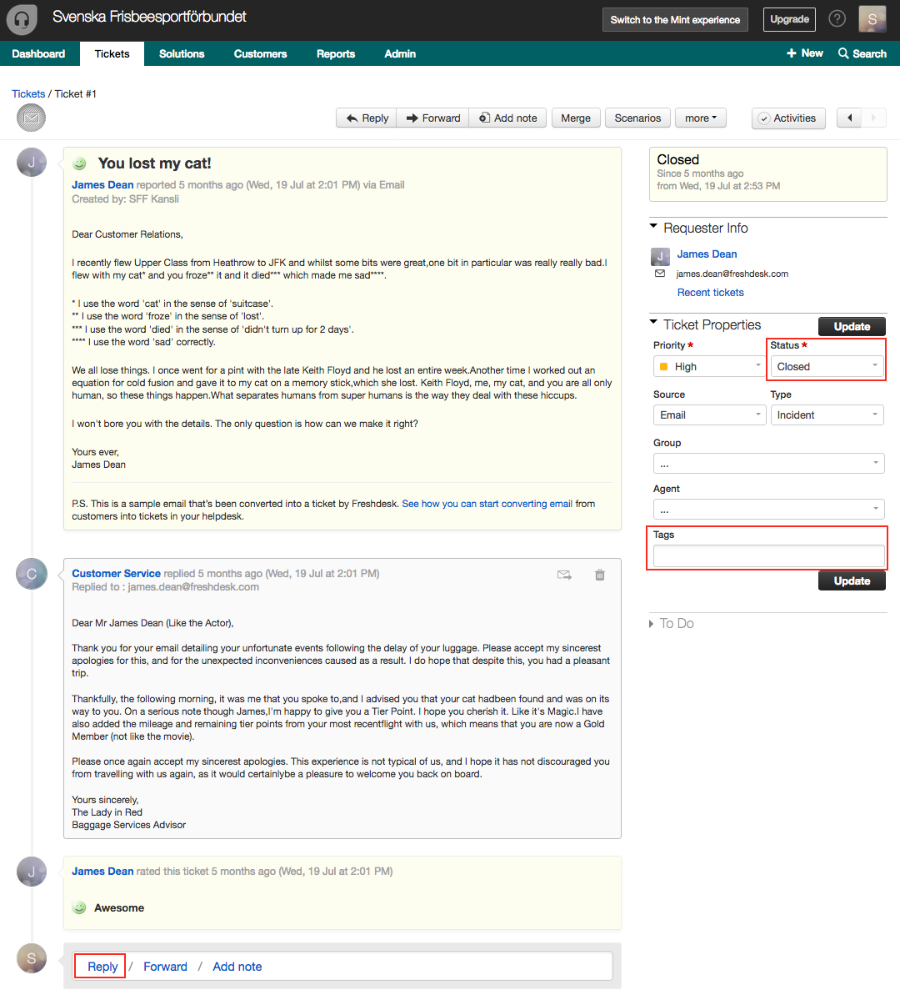
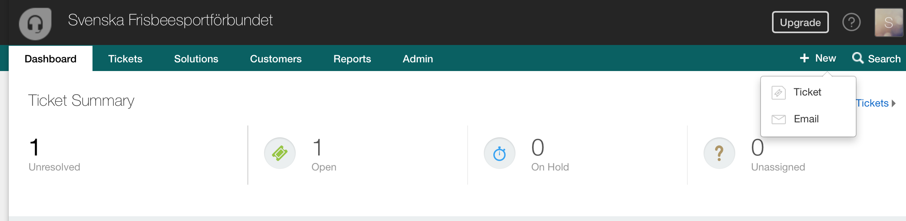
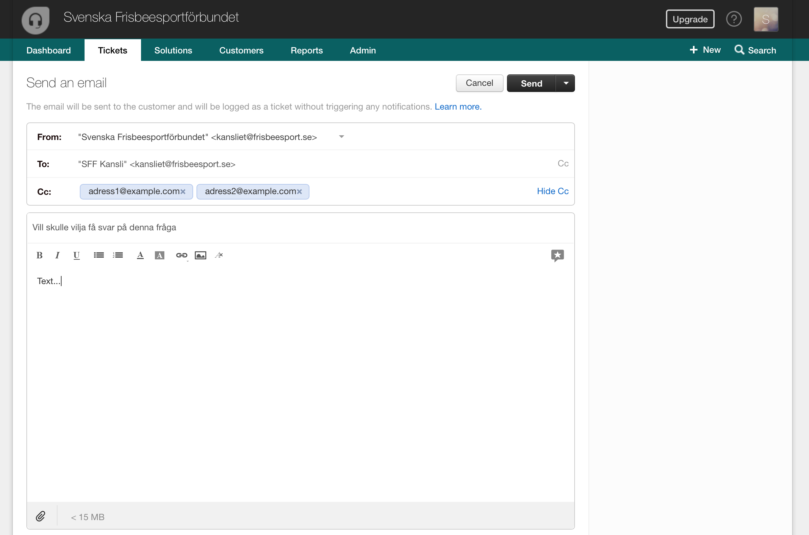

# Ärendehantering

[Freshdesk](https://frisbeesport.freshdesk.com) används som ärendehanteringssystem. Alla mail som skickas till 
kansliet@frisbeesport.se vidarbefodras till Freshdesk. I Freshdesk samlas alla mail som rör ett ärende i en tråd så det blir enkelt att få en överblick. När ett ärende är hanterats och stängts finns det kvar i historiken. Det går att sätta prioritet på ärdenden och man kan även följa upp vilken tid det tar för oss att besvara de frågor som kommer in. Genom rapporter kan man se hur många ärenden som kommit etc.

Det finns här möjlighet att skapa inlogg för flera s.k. agenter som kan jobba med att besvara frågor. Vi har nu en agent man kan köpa till flera vid behov.

## Hantera inkommande mail/ärenden

Ett ärende skapas för varje inkommande mail. Genom att klilcka på `Reply` längst ner i ärendet besvaras frågan i mailet. När ett ärende är slutfört ska det stängas genom att ändra `Status` till `Closed`. Det är viktigt att görta detta då ett ärende är slutfört statistiken avänder tidpunkt för när ärenden skapas och stängs. Alla ärenden ska märkas med samma koder som används för tidrapportering, se rutinen för Tidrapporter.

Det går också att ta bort ärenden som skapats av missatag samt att markera ärenden som spam vilket blockerar avsändaren från att skapa nya ärenden.

## Ärenden med flera parter

Det går även att skicka mail från Freshdesk och då skapas samtidigt ett ärenden. Genom att använda CC:fältet går det att maila
flera mail-adresser samtidigt och deras svar kommer att kopplas till ärendet.

Här är ett exempel på mail till flera mottagare:

