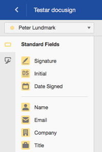

# Docusign

Docusign används då styrelsen (eller andra) ska signera dokument. Logga in på [docusign.com](https://www.docusign.com)

## Kontakter

Om man ska skicka många dokument för signatur är det bra att först lägga upp dessa som kontakter:

1. Kontakterna ligger under Preferences: 
1. Administrera kontakter: 

## Skicka dokument

1. Välj send på första sidan: 
1. Klicka på person-ikonen i fältet Name för att hämra från contacts
1. Ladda upp dokumentet som ska signeras 
1. Klicka på den gula next knappen uppe i högra hörnet
1. Välj person som ska signera: 
1. Placera ut signaturen och övriga fält du vill personen ska fylla i
1. Uppreapa föregående två steg för alla personer
