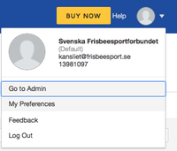
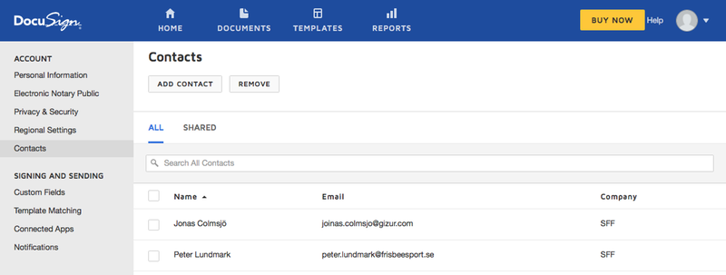
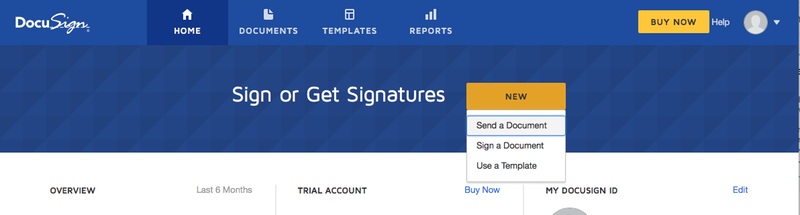
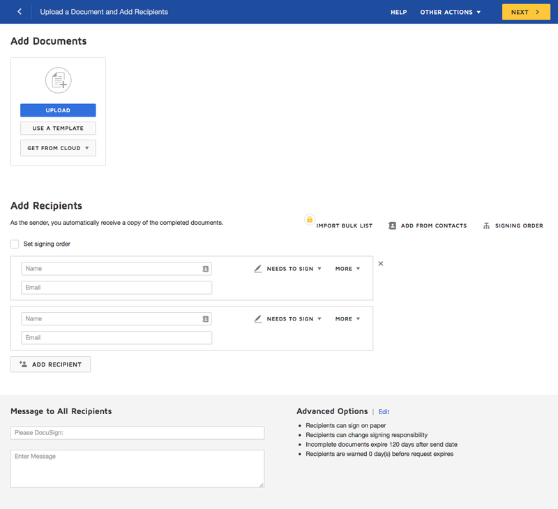

# Docusign

Docusign används då styrelsen (eller andra) ska signera dokument. Logga in på [docusign.com](https://www.docusign.com)

## Kontakter

Om man ska skcika många dokument för signatur är det bra att först lägga upp dessa som kontakter:

1. Kontakterna ligger under Preferences: 
1. Administrera kontakter: 

## Skicka dokument

1. Välj send på första sidan: 
1. Ladda upp dokumentet som ska signeras 
