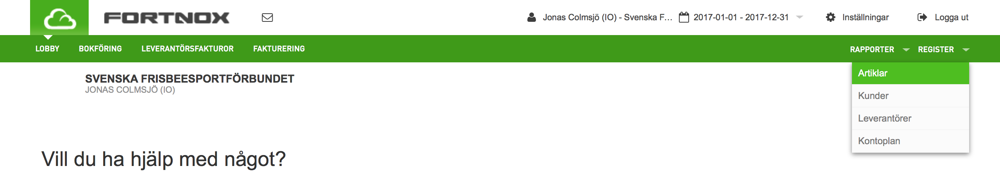
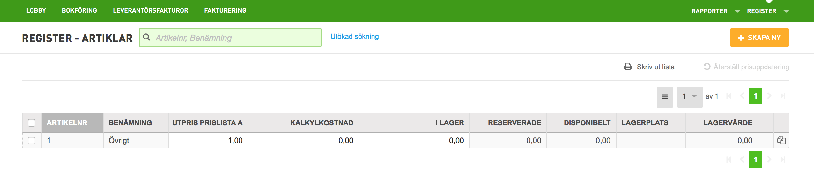
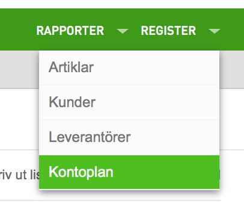
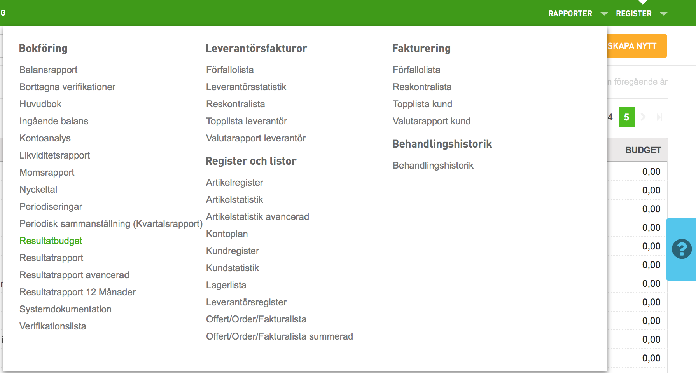
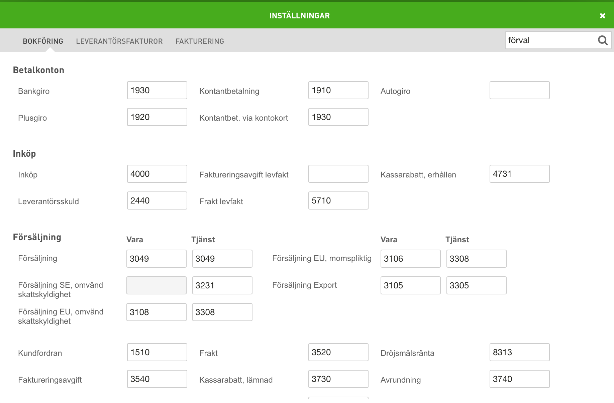
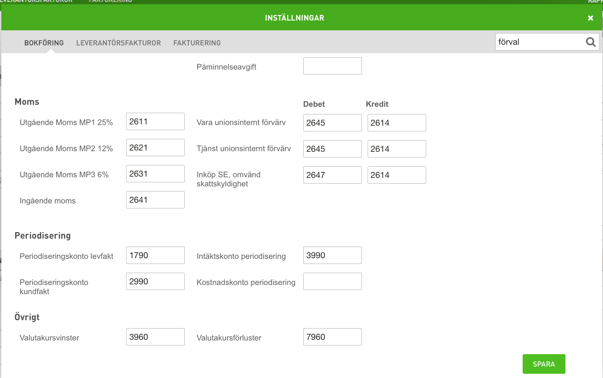
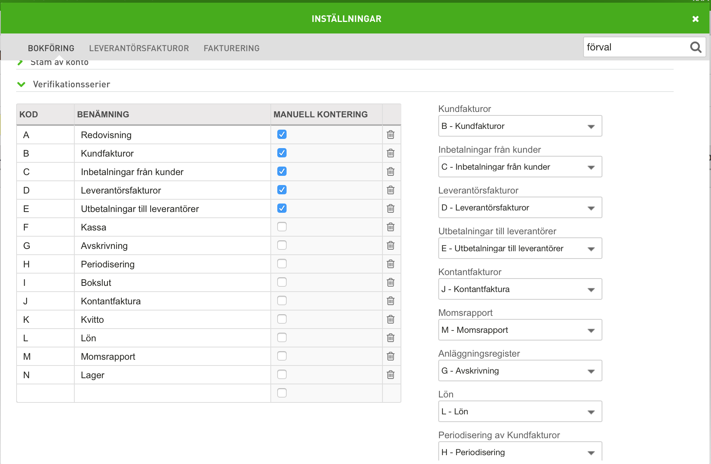
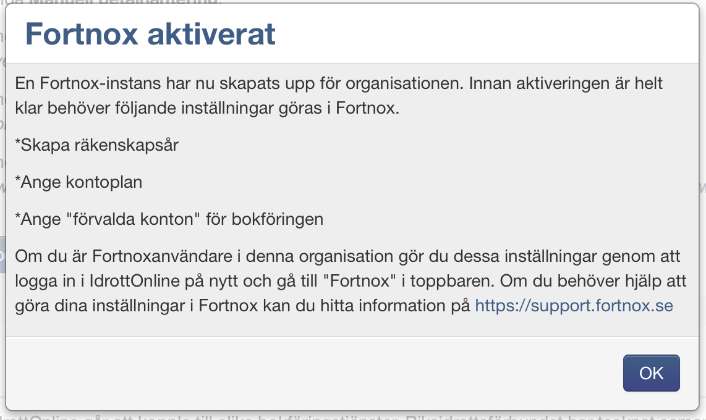
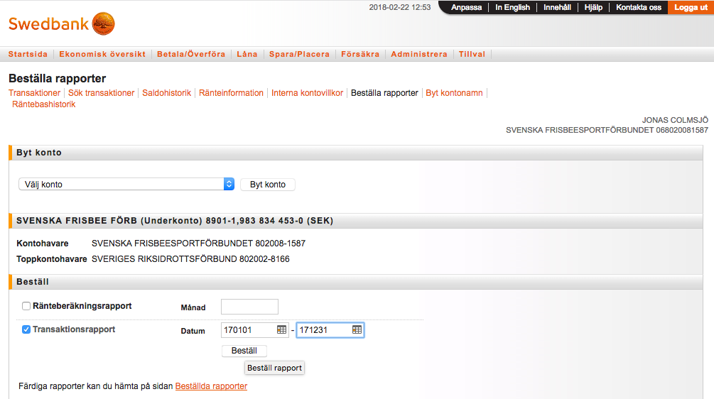
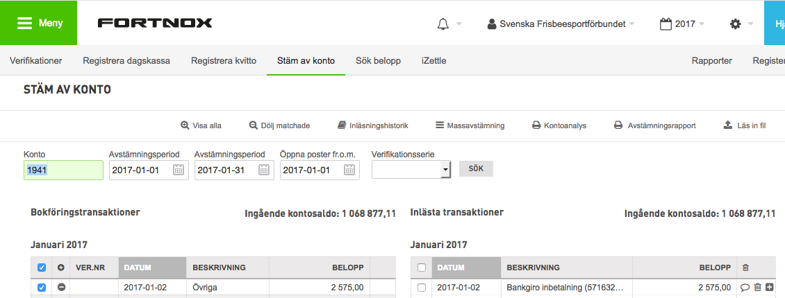

# Ekonomiprocesser

# Fortnox

Fortnox har en egen YouTube-kanal med bra [informationsfilmer](https://www.youtube.com/user/FortnoxAB).

## Leverantörsfakturor

Lägg upp nya leverantörer under Register -> Leverantörer.

Skapa leverantörsfakturor under Leverantörsfakturor -> Skapa ny.

### Attest i Fortnox

Information om hur attest av leveranstörsfakturor sätts upp finns [här](https://support.fortnox.se/hc/sv/articles/208334015-Kom-igång-med-Fortnox-Leverantörsfakturaattest).

Attest för fakturor över av FS beslutad belopps gräns är uppsatt. Attestanter får mail på sin Frisbeesport-adress när det är dags att attestera en faktura.

### Attest (gammal rutin)

Fakturor som överstiger 20.000 kronor ska attesteras av två styrelseledamöter enligt konstituerande styrelsebeslut. Attestering görs i Google Drive:

1. Gå till Ekonomi -> Attester -> Högerklicka -> Välj Kalkylark -> Från en mall -> Attest Utbetalning
1. Spara en kopia på faktura i samma Google Drive map
1. Maila länk till till mappen med Attester till de som ska attestera

## Fakturering

Artiklar måste vara upplagda för att kunna fakturera. Artiklar finns under `Register->Artiklar`.

För varor och tjänster som inte faktureras återkommande kan artikeln `Övrigt` med priset
1 Kr användas (konto 3048). För varor och tjänster som faktureras återkommande ska separata artiklar 
läggas upp och kopplas mot rätt konto.

## Budget

Budgeten läggs in i kontoplanen som nås via `Register->Kontoplan`

Under `Rapporter->Resultatbudget` ser man uppföljning mot budget.

## Inställningar för bokföringen

Förvalda konton visas nedan.

Verifikationsserierna A-E har lagts satts upp.

## Fornox aktivering

## Avstämning av bankkonto

Bankkontot ska stämma av i arebtsveckan efter månadens slut. Detta görs med en bankfil från Swedbank som laddas in i Fortnox.

[Här](https://support.fortnox.se/hc/sv/articles/115005776889-St%C3%A4m-av-konto) finns en guide hur avstämning av bank-kontot enkelt kan göras. [Här](https://support.fortnox.se/hc/sv/articles/115005472009-H%C3%A4mta-kontoutdrag-f%C3%B6r-St%C3%A4m-av-konto) finns instruktioner hur man laddar ner en fil från Swedbank.

Swedbank:

* Logga in i internetbanken och ta ut en rapport
* Gå till beställda rapporter och ladda ner en TXT-fil

Fortnox:

* Välj Bokföring > Stäm av konto
* Välj Läs in fil och ladda in filen från Swedbank
* Välj Matcha transaktioner
* Gå ingeom de transaktioner som inte matchades automatiskt och matcha desssa manuellt
* Ev. transaktioner som finns i banken men inte i bokföringen kan läggas in genom att klicka på + ikonen
* Ev. transaktioner som finns i bokföringen men inte i banken är felaktiga och behöbver utredas och rättas

