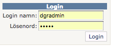
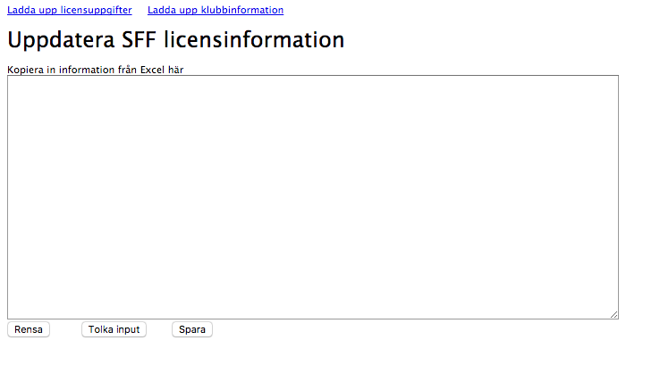

Licensierade spelare och registrerade klubbar hanteras i Idrottonline. För att enkelt kunna visa licens och klubblista på 
hemsidan används en databas som finns [här](http://www.discgolfresultat.se/Login.aspx?ReturnUrl=%2fadmin%2fSFFPlayers.aspx)

[Här](http://www.discgolfresultat.se/iSFFPlayers.aspx) kan man söka i databases.

Databasen ligger på siten discgolfresultat.se.

Klistra in excelfil, Tolka input och klicka till sist på Spara, när det står Klart är det ok.
[Här](./media/licens_o_klubb_db/exempel_fil.xls "exempel_fil") är en fil som visar hur det som klistras in ska se ut.

För klubb ser filen lite annorlunda ut och kräver ju inte alls samma intervall vad gäller uppdatering 
