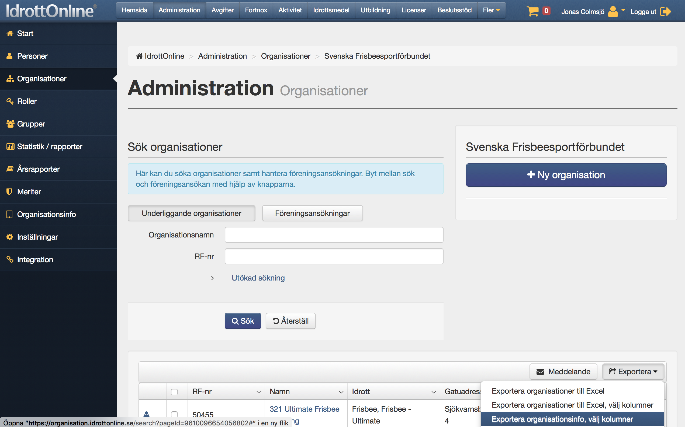

# Rutiner SFF medlemsförteckning from 2017

## Medlemsförteckning på Google Drive

Kansliet ansvarar för att det alltid finns en uppdaterad lista med kontaktuppgifter till SFF:s föreningar på GD i [denna katalog](https://drive.google.com/drive/u/2/folders/1YkchsKlP6WNppPOP6Ho69oRH1ITTREJH)

Listan med kontaktuppfigter kan t.ex. skapas i IdrottOnline med funtionen 'Exportera Organisationsinfo', se figur nedan.

Listan ska uppdaetras då föreningar avförs från medlemsförteckningen, då föreningsansökningar godkänns och första arbetsdagen i varje kalendermånad.

## Rutin för ny förening

Ny förening ansöker via IdrottOnline, RF behandlar, ansökan går sedan till förbundskansliet som i sin tur skickar vidare till grenförbund som bifaller/kommenterar/avslår, därefter går ansökan till FS som fattar slutligt beslut som protokollförs.

Arbetsgången gällande dokumentation och FS-beslut är följande:

* Kansliet sparar underlaget i GD
* Kansliet granskar dokumentationen
* Kansliet begär kompletteringar från förening om någon dokumentation saknas
* Kansliet mailar FS en rekommendation att godkänna förening när all dokumentation finns på plats
* Kansliet lägger till att beslut behöver fattas av FS i att göra-listan
* FS fattar beslut som dokumenteras i (nästkommande) protokoll
* Kansliet uppdaterar att göra-listan
* Kansliet uppdaterar SFF medlemsförteckning, meddelar förening och GF, samt lägger upp nyhet på hemsidan.

## Rutin för årlig uppföljning av medlemsförteckning och föreningsverksamhet

I slutet av varje år delger alla föreningar signerade föreningsdokument samt besvarar frågeformulär som FS beslutat.

Varje förening får en mapp med “Föreningens namn” och årtal i Föreningar->Medlemsförteckning i google drive där inskickade årsmötesprotokoll, stadgar och medlemsförteckning arkiveras.

Efter sista deadline kompletterar kansliet svarsfilen från frågeformuläret med kolumner för vilka datum de senaste två medlemsavgifterna betalats in samt om något av föreningsdokument saknas eller är bristfälligt.

Om medlemsavgift inte betalats in anges istället “Påminnelse 1 datum”, “Påminnelse 2 datum” osv så att dokumentation finns när FS informeras.

I slutet av varje år delger GF signerad medlemsförteckning och bekräftar därmed att medlemsföreningarna fortfarande uppfyller alla krav för GF-medlemskap.

## Rutin för uppföljning av förenings åligganden och för beslut om att avföra förening från medlemsförteckningen
Påminnelser om medlemsavgift eller efterfrågade föreningsdokument samt uteslutningsärenden ska skötas på ett korrekt sätt enligt en på förhand uppsatt och offentliggjord plan.

Om förening trots påminnelser inte betalat medlemsavgift eller det uppmärksammats att föreningen på annat sätt inte uppfyller stadgar, årsmötesbeslut eller övriga bestämmelser ska kansliet informera FS för beslut.

Begäran från förening om utträde från SFF ska delges FS som fattar formellt beslut att avföra föreningen från medlemsförteckningen.

Beslut om att avföra förening från SFF medlemsförteckning ska protokollföras och förening, GF och RF ska informeras.

## Engångsinsats för dokumentation av händelser i medlemsförteckning 2015-2017:

Kansliet sammanställer vilka föreningar som avförts från medlemsförteckningen 2015-2017 med underlag för beslut, samt vilka föreningar som tillkommit under samma period och delger FS när färdigt.

## Länkar

* [Ansökan om medlemskap i specialidrottsförbund](http://www.svenskidrott.se/bildaidrottsforening/ansokanommedlemskapisf/)
* [Att starta en förening](http://www.frisbeesport.se/foreningar/attstartaenforening/)

