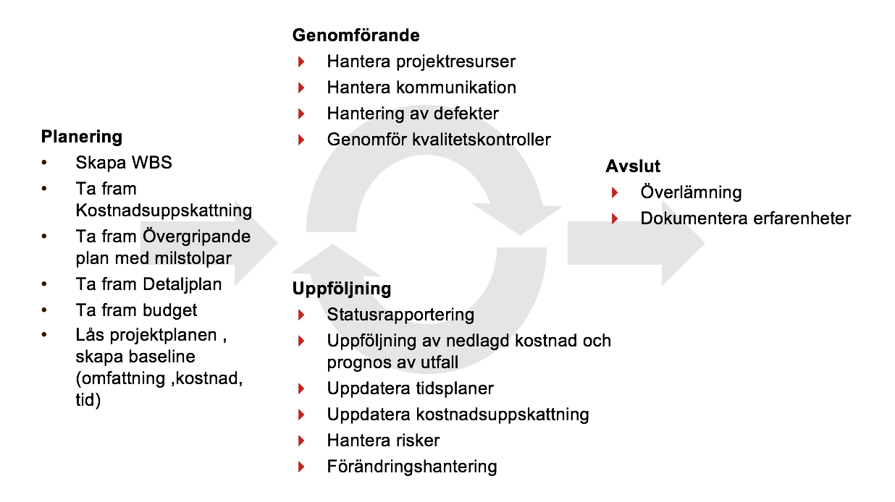
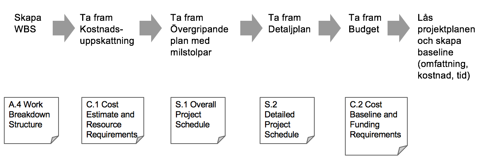
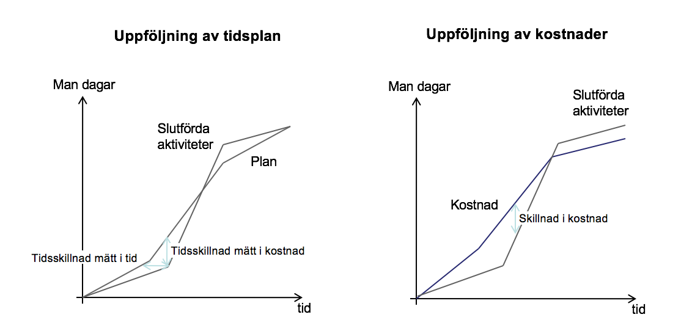
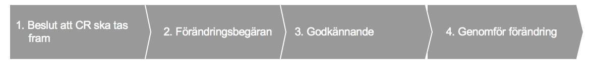
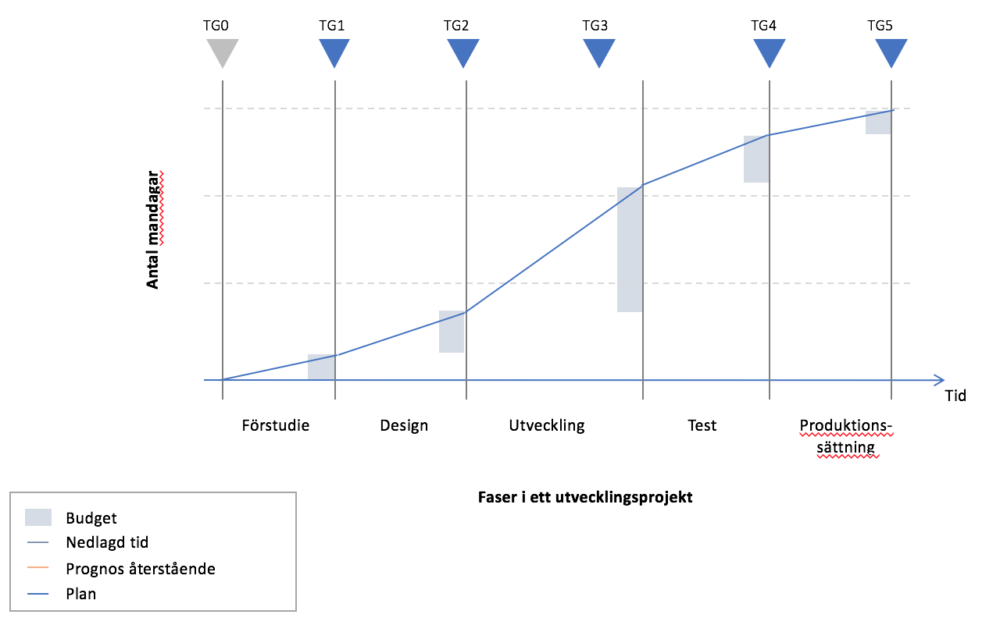
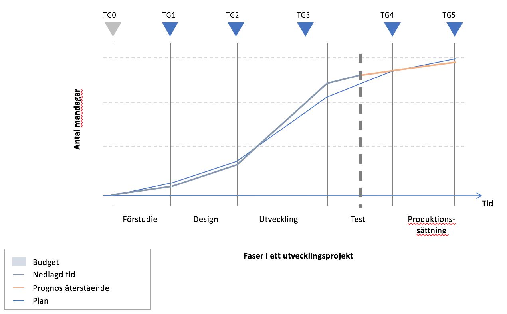

# Projektledningsprocesser för Svenska Frisbeesportförbundet

Här beskrivs de projektledningsprocesser som ska användas inom Svenska Frisbeesportförbundet. Processernas är baserade på [Project Management Institute’s (PMI)](http://pmi.org) handbok men har förenklats och anpassats för att passa ideella förbund och föreningar. Processerna har tagits fram inför arbetet med Idrottslyftet 2017-2019 men de är generella och kan användas inom alla typer av projekt.

# Översikt över planeringsprocesserna

* En bra plan gör det möjligt att följa upp projektet och att proaktivt kunna göra förändringar i lösning, planer, och bemanning 

## Projektledningsprocesser

1. Skapa WBS
1. Ta fram Kostnadsuppskattning
1. Ta fram Övergripande plan med milstolpar
1. Ta fram Detaljplan
1. Ta fram Budget
1. Lås projektplanen, skapa baseline (omfattning, kostnad, tid)

## Dokument

A. Övergripande projektdokumentation:

* A.4 Work Breakdown Structure
* A.5 Steering Documents

C. Kostnader:

* C.1 Cost Estimate and Resource Requirements
* C.2 Cost Baseline and Funding Requirements
* C.3 Actual Cost, Performance Measurements and Forecast Completion

S. Tidsplan:

* S.1 Overall Project Schedule
* S.2 Detailed Project Sehedule
* S.3 Resource Schedule

Organisation:

* O.1 Project Organisation Charts
* O.2 Roles and Responsibilities

## Genom planeringsprocessen detaljeras gradvis planen

# Översikt över uppföljningsprocesserna

* Genom att arbeta strukturerat med actionlog, statusrapporter och mötesanteckningar kan projektarbetet bedrivas effektivt
* Genom att kontinuerligt följa upp mot plan kan korrigerande åtgärder vidtas i tid

## Uppföljning

* Statusrapportering
* Uppföljning av nedlagd kostnad och prognos av utfall
* Uppdatera tidsplaner
* Uppdatera kostnadsuppskattning
* Förändringshantering
* Hantera risker

## Dokument

C.3 Actual Costs, Performance Report and Forecast Completion

PI. Projektledning:

* PI.1 Actionlog
* PI.SG Stygruppsmaterial
* PI.SR Statusrapporter
* PI.MM Mötesanteckningar

CR. Förändringshantering:

* CR.1 Approved Change Requests
* CR.2 Rejected Change Requests

R.1 Risk Register

## Uppföljning av kostnader och tidsplan

PMI:s projektmodell andvänder sig av [Earned Value metoden](https://en.wikipedia.org/wiki/Earned_value_management) för att mäta projektens framdrift. Modellen är lite komplex men det viktiga är att mäta vad som faktiskt producerats i förhållande till planen. Alltså inte endast % klart, vilket annars är vanligt.

## Förändringshantering

En kontrollerad process för att hantera förändringar är viktigt för att projektets omfattning inte ändras okontrollerat

# Översikt över genomförandeprocesserna

I genomförandet ligger fokus på projektresurser, kommunikation, kvalitetskontroll och hantering av defekter

## Genomförande

* Hantera projektresurser
* Hantera kommunikation
* Genomför kvalitetskontroller
* Hantering av defekter

## Dokument

* R.1 Risk Register
* PI.RE Review Dokumentation
* DE. Defekter

# Tollgates

Tollgates används för att gradvis ta investeringsbeslut och säkerställa att projektet levererar enligt plan. Tollgate beslut tas av styrgruppen och baseras på ett underlag som projektledaren tar fram. 

Vid varje tollgate finns tre möjliga beslut:

1. Godkänn tollgaten och starta nästa fas enligt den plan som projektet presenterat
1. Ge projektet i uppgift att omarbeta planen för nästa fas
1. Avsluta projektet

Inför TG0-beslutet ska följande dokument finnas:

* Uppdragsspecifikation
* Övergripande preliminär projektplan
* Aktivitets- och resursplan för förstudie
* Uppskattad kostnad för förstudien
* Beslutsunderlag till styrgrupp

Inför TG1-beslutet ska följande dokument finnas:

* Projektspecifikation
* Gapanalys
* Benefit and cost analysis
* Budget för analys- och designfasen
* Aktivitets- och resursplan
* Processdesign
* Beslutsunderlag till styrgrupp

Inför TG2-beslutet ska följande dokument finnas:

* Uppdaterad projektspecifikation
* Detaljerad gapanalys
* Final Benefit and cost analysis
* Projektbudget
* Aktivitets- och resursplan
* Detaljerad processdesign
* Beslutsunderlag till styrgrupp

Change Management plan:

* Kommunikationsplan
* Kommunikationskalender
* Utrullningsplan och metod
* Utbildningsplan

Teknisk dokumentation (gäller endast IT-projekt):

* Teststrategi
* Integrationsdesign
* Interface agreements
* Gränssnittskarta
* RICEFW (lista utvecklingsobjekt)

Inför TG3-beslutet ska följande dokument finnas:

Inför TG4-beslutet ska följande dokument finnas:

Inför TG5-beslutet ska följande dokument finnas:

## Exempel på plan

## Exempel på uppföljning mot plan

