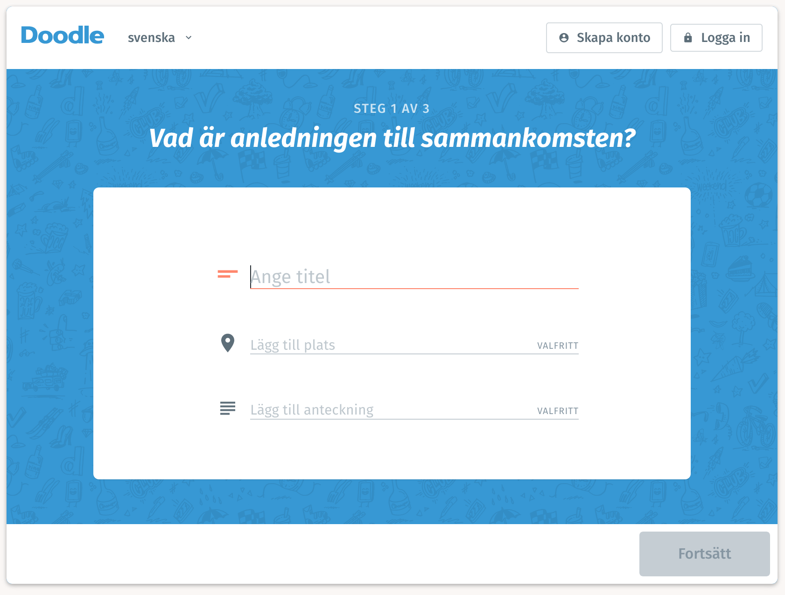
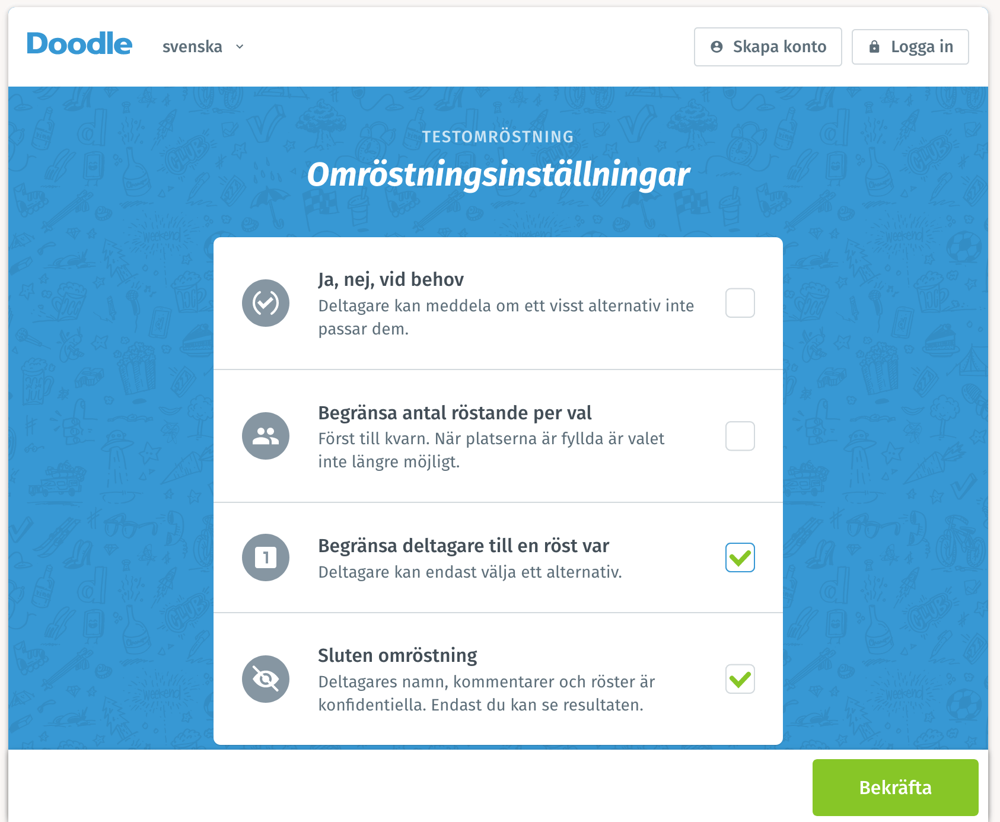
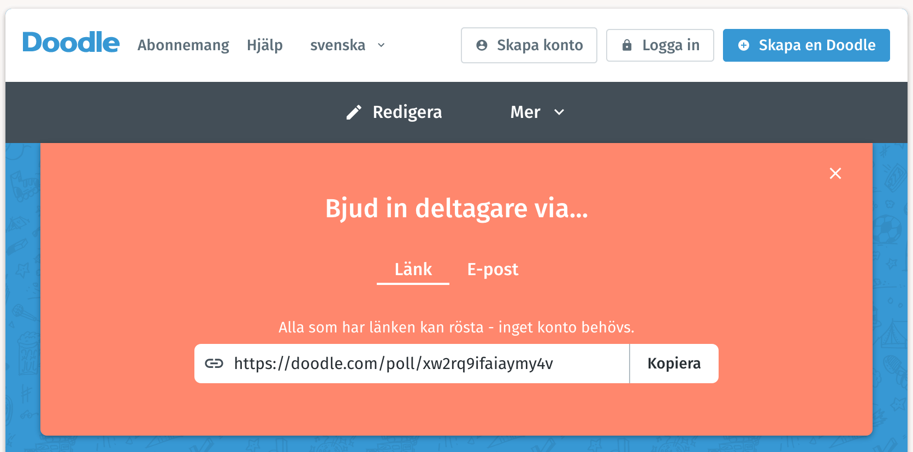
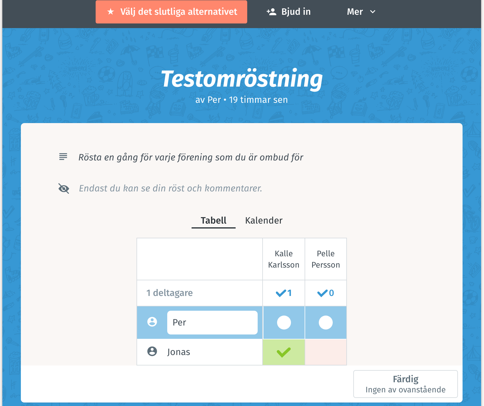
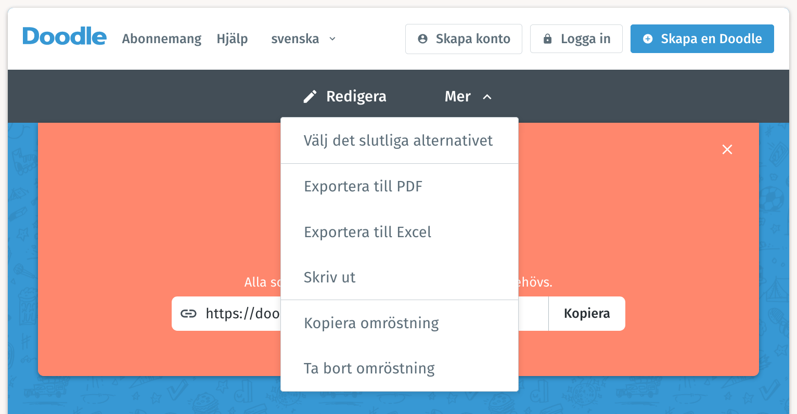

# Rutin för omröstning vid deltagande via elektronisk tjänst

Verktyget Doodle Webomröstning används för omröstningar då deltagarna deltar elektroniskt för att effektivisera processen 
och minska risken för fel. 

Ett alternativ är att ordföranden ropar upp namnen på ombuden som ska rösta. När ombudets namn ropats upp avget hen 
sina röster för de föreningar hen representerar. Vid problem med en webomröstning kan ordföranden välja att använda denna metoden istället.

Input:

* Mailadresser för ombuden som ska rösta
* Titel på omröstning
* Alternativ som ombuden kan rösta på
* Namn och mailadress för kontaktperson som håller i omröstningen

Rutin för den som arrangerar omröstningen:

* Öppna Doodle med denna länk: [https://doodle.com/sv/webomrostning](https://doodle.com/sv/webomrostning)
* Välj 'Skapa' omröstning en bit ner på sidan
* Ange titel
* Ange en kommentar, t.ex. 'Rösta en gång för varje förening som du är ombud för. Instruktioner för hur röstningen görs finns här: http://styrelse.frisbeesport.se/rostning_ombud'
* Välj 'Fortsätt'
* Välj inställningar och välj 'Sluten omröstning', 'Begränsa deltagare till en röst var' och välj sedan 'Bekräfta'
* Ange alternativen som ombuden kan rösta på
* Ange namn och mailadress för kontaktpersonen och välj 'Slutför'
* Kontrollera på omröstningen som visas en bit ner på sidan så att det ser bra ut. Redigera om nödvändigt.
* Kopiera länken till omröstningen och maila till till ombuden. Ange en titel som t.ex. 'Omröstning styrelseledamot'.
* På sidan syns valen för de som röstat. Uppdatera sidan för att se nya röster.
* När alla ombud lagt sin röst sparas omröstningen genom att välja 'Mer' > 'Exportera PDF'
* Sedan väls 'Mer' > 'Till slutgiltigt resultat'

## Skärmdumpar

Startsida:

Inställningar:

Dela länk:

Preliminärt resultat:

Till resultat:

