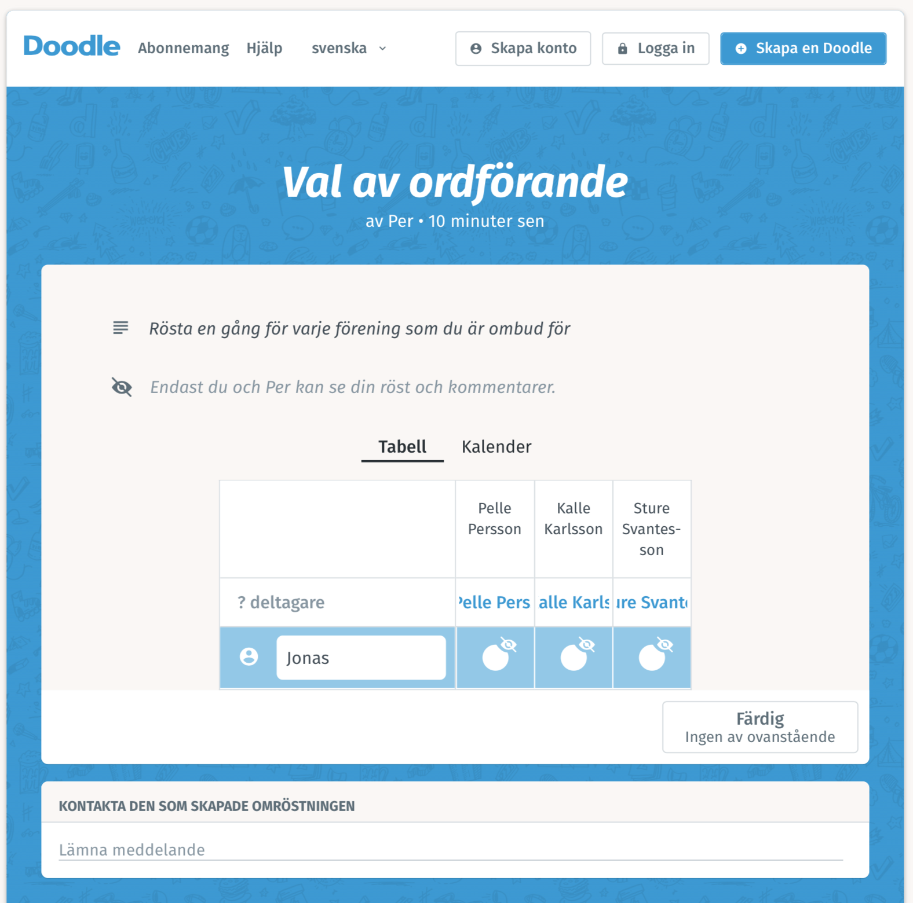

# Webomröstning - Instruktion för ombud

* Klicka på länken i mailet (eller kopiera länken till en webläsare). Doodle sida för röstning visas.
* Ange namnet på föreningen du representerar och ska rösta för och ditt egen namn i parentes
* Ange alternativ du röstar på. Det går att rösta blank genom att välja 'Färdig. Ingen av ovanstående'
* Välj 'Färdig'
* Välj tillbaka till omröstningen om du representerar flera föreningar. Upprepa proceduren för nästa förening.

## Doodles webomröstning

